**Tryhackme: Oh My Webserver**

**Enumeration:**

**Rustscan:**

l start with rustscan first for find ports and l found
22(ssh),**80(http)** ports.

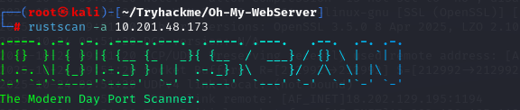

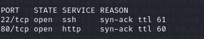

**Nmap:**

After rustscan use nmap for check ports version.

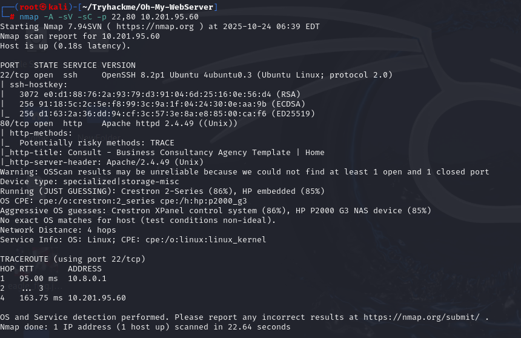

**Searchsploit:**

When I searched for the HTTP port version in Searchsploit, I found
**Path Traversal** and **RCE** in **Apache HTTP server
2.4.49**.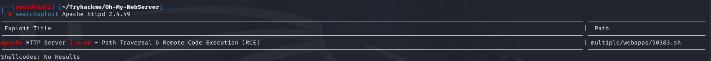

**Metasploit:**

l want use **metasploit** for exploit this vulnerability.We search this
vulnerability in metasploit and we found it .After we found exploit use
**exploit/multi/http/apache_normalize_path_rce** and set options.

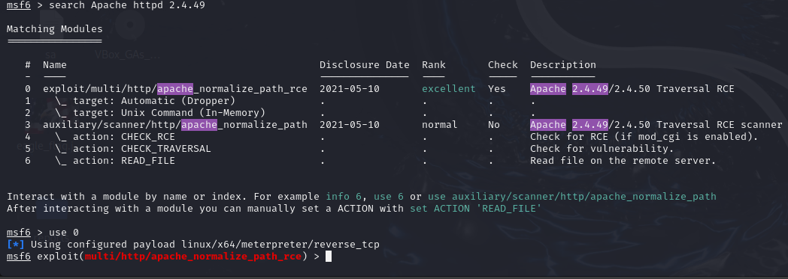

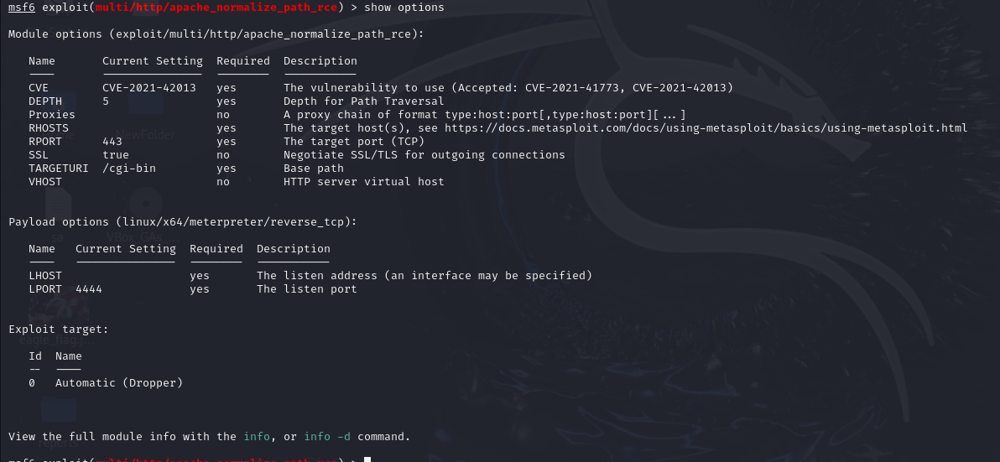

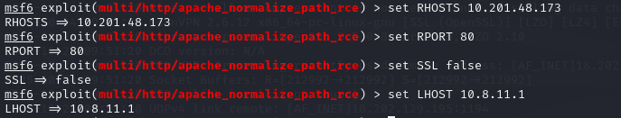

Run and get **meterpreter**.

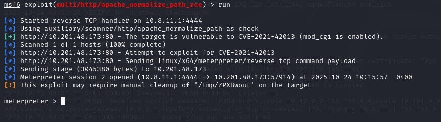

We use shell command to get shell.

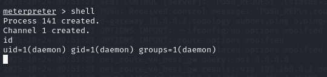

I used this command(**python3 -c 'import pty; pty.spawn("/bin/bash")'**)
to get a fully interactive shell so that the username, hostname, and
current directory appear properly in the prompt.

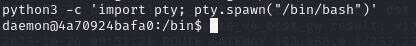

l look **/home** directory found the user flag but l can’t find
anything.

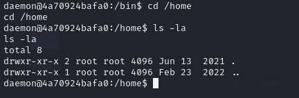

l use python server for upload linpeas target machine for privileges
escalation.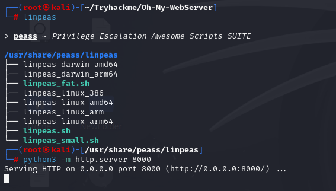

l use wget but machine haven’t **wget** after this l use **curl**.

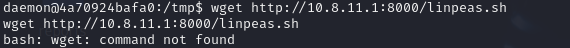

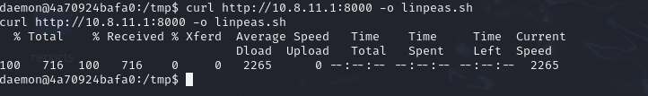

Give permission **linpeas.sh** and run it.

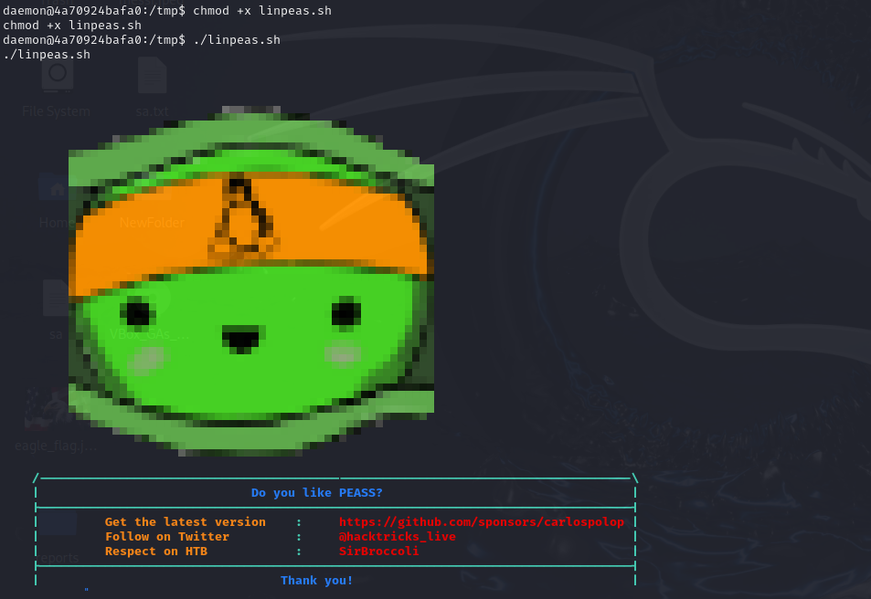

l found **/usr/bin/python3.7 = cap_setuid+ep** we can use this for
privileges escalation.

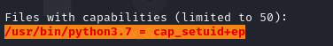

l go gtfobins for privileges escalations with **python3.7
capabilitites**.

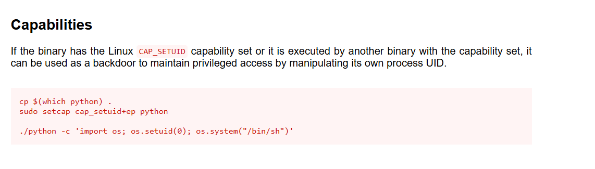

l use **python3.7 -c 'import os; os.setuid(0); os.system("/bin/sh")'**
command and we got root and user flag.

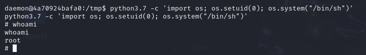

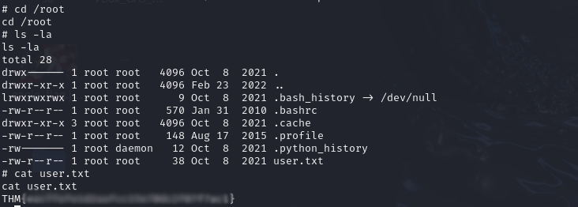

We get user flag but we can’t get **root.txt**.l check **/etc/hosts**
and found **172.17.0.2** ip.

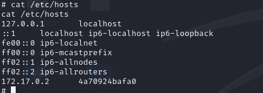

We have same ip in this machine.**172.17.0.2** is container we must
check **172.17.0.1** ip l use nmap but this machine haven’t nmap and l
built **port-scanner.py** with **ChatGPT** and l upload this port
scanner in target machine and run it we see **5986** port.

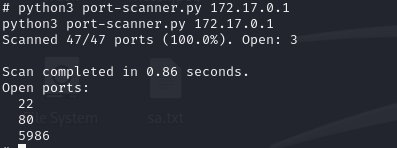

l use google for searching **5986** port exploit and l found
**CVE-2021-38647** vulnerability.

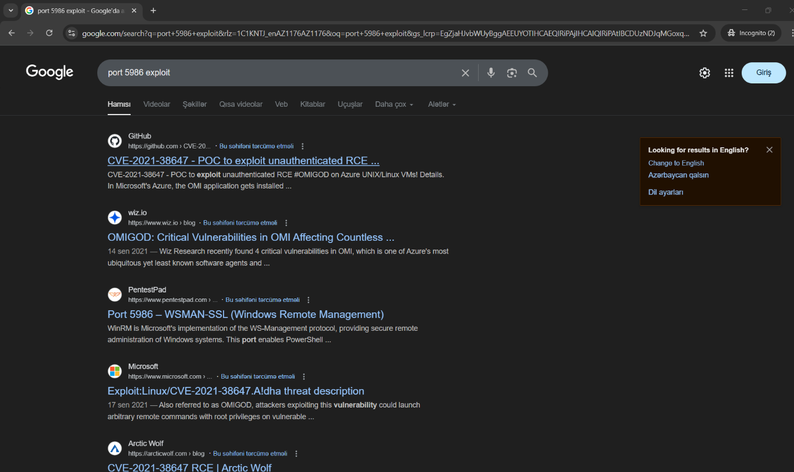

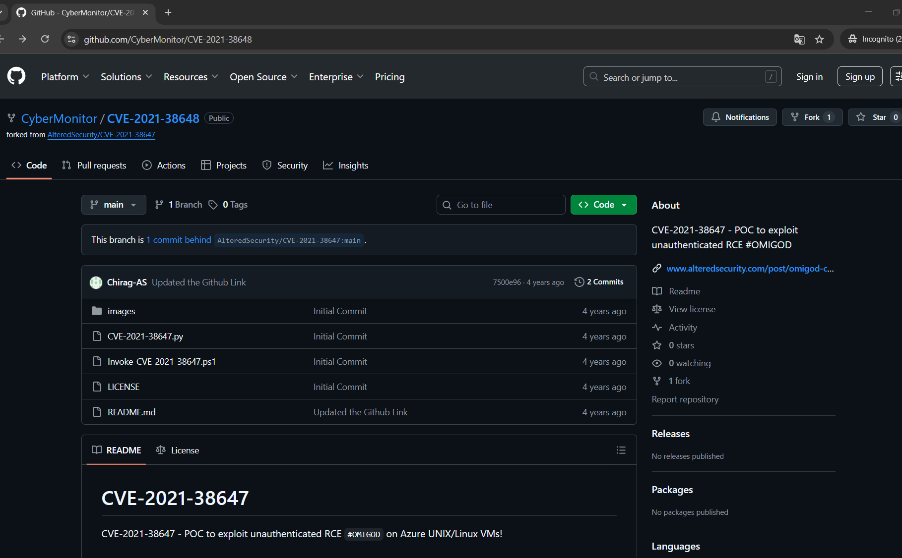

Again l copy **CVE-2021-38647.py** and run first **id** command work it.

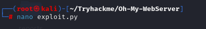

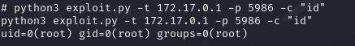

After this l try to get **/root/root.txt** and we got root flag.

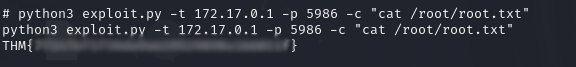
