**Tryhackme: Wgel Ctf**

**Enumeration:**

**Rustscan:**

First one l start with rustscan for check port:

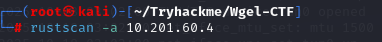

We have 2 open port(22,80):

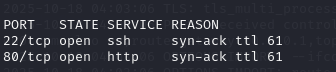

**Nmap:**

Lets check ports version with nmap:

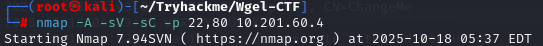

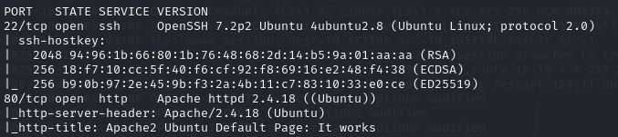

**Searchsploit:**

Okay lets check ssh version with searchsploit:

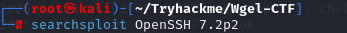

SSH version allows username enumeration**:**

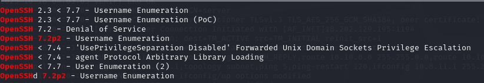

Let's remember this, it might be necessary.

When we check http server we see apache2 default page.

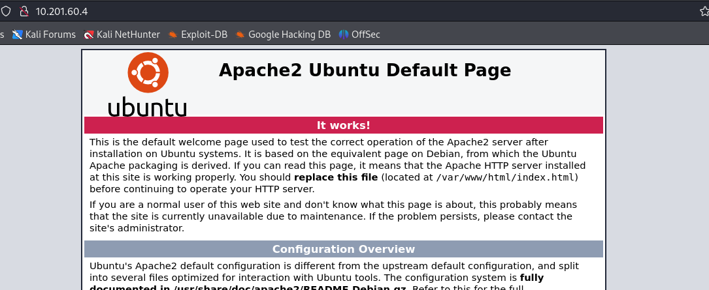

Let’s check first source code.When we check source code we see jessie
name in source code.

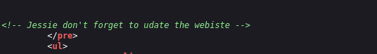

l try brute force with this username to ssh with hydra but l can’t find
password.

**Dirsearch:**

It is time to directory search with dirsearch.

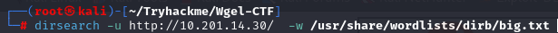

We found <u>/sitemap directory.</u>

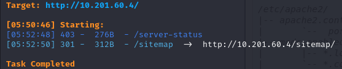

Let’s check it.

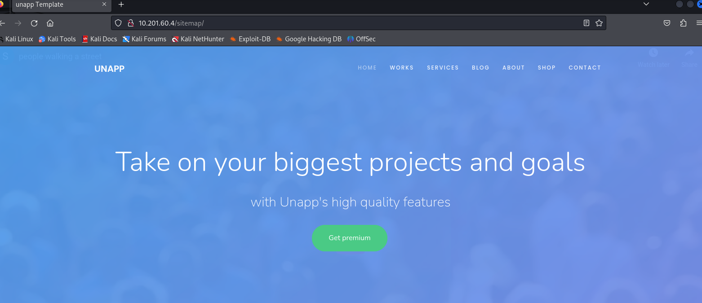

l full check site but l can’t find anything.

Let’s again directory search.

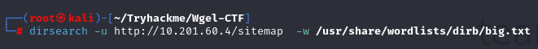

We found **/sitemap/.ssh** directory.

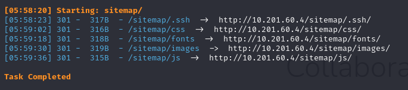

l check it and found id_rsa.

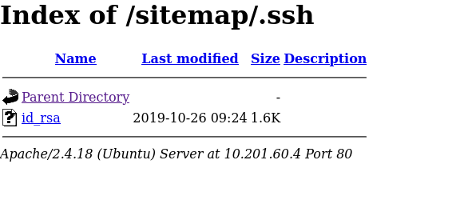

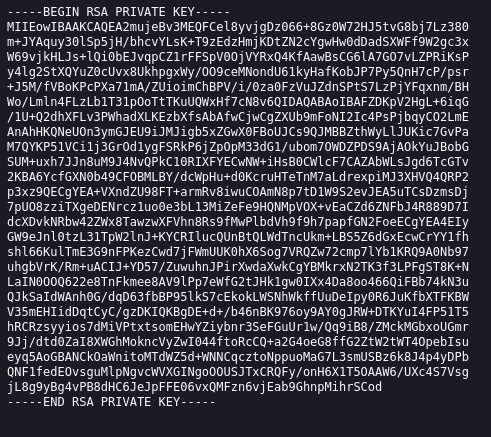

Let’s first save this by **id_rsa**,give permission after use this for
connect to ssh with jessie user.

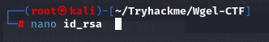

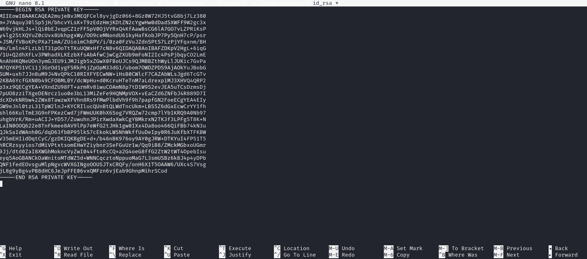

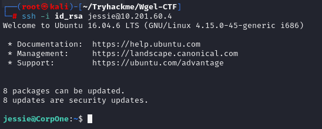

Successful login and right now check **/home/jessie**.

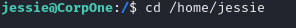

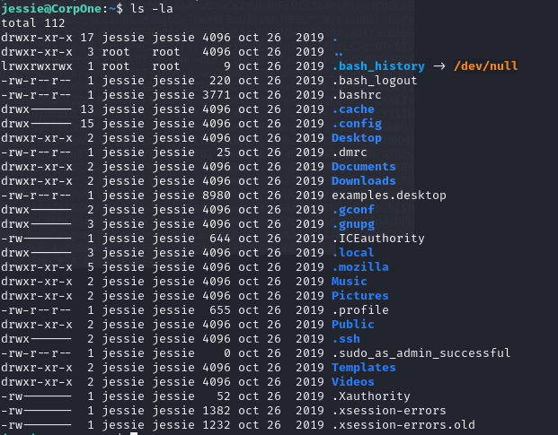

When we check Document we find **user_flag.txt.**

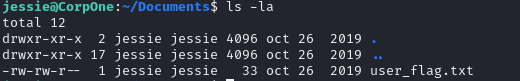

First we try sudo -l command for privileges escalation.

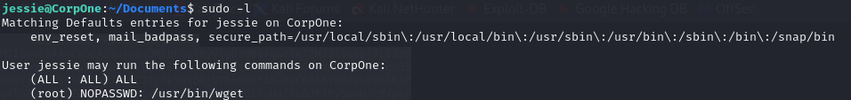

We see **/usr/bin/wget** we can use wget for found root flag.We check
gtfobins website.

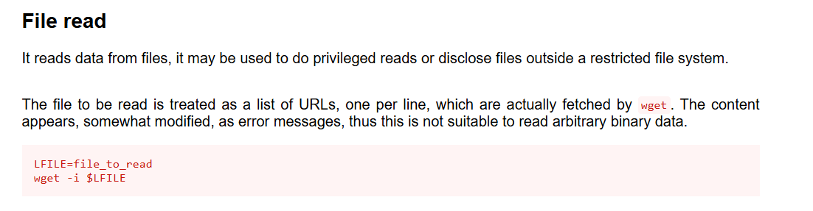

Okay use this for read the root flag.

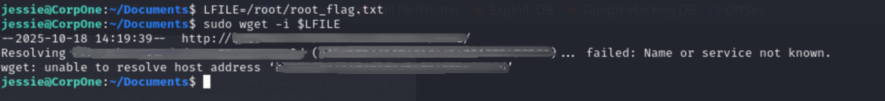

We found root flag.
