**Tryhackme: Wonderland**

**Enumeration:**

**Rustscan:**

l started enumeration with **rustscan** and found two open
port **22**(**http**) and **80**(**ssh**).

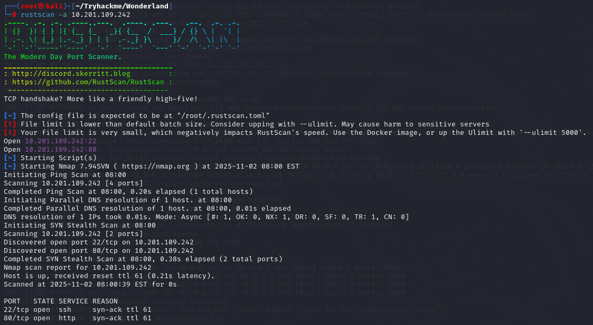

**Nmap:**

After **rustscan** l go with **nmap** for found ports version.

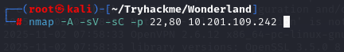

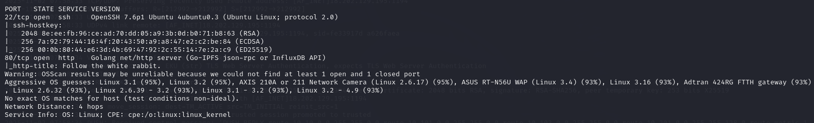

There were no known vulnerabilities in the versions of the two services.

I decided to check the HTTP service. The webpage showed the phrase
*“Follow the White Rabbit”* and one photo.

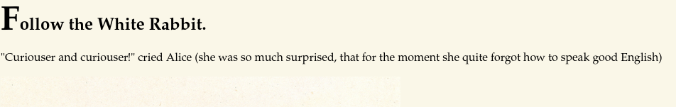

l decided to check **source code** but l can’t find anything.

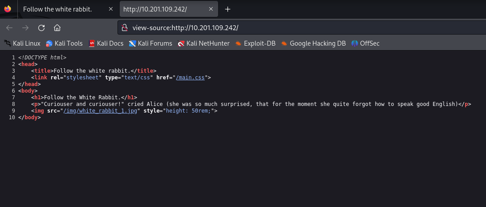

After check source code l decided check photos **metadata** with
**steghide**. I run **steghide extract -sf white_rabbit_1.jpg**. The
tool prompted for a **passphrase**.I pressed **Enter** to submit an
empty passphrase and observed that the file had no passphrase set and we
found **hint.txt**.Let’s check **hint.txt**.

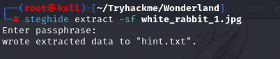

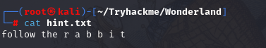

Maybe this “*follow the r a b b i t*” is real hint l we must don’t
forget this message.

**Dirsearch:**

Let’s check directorys with **dirsearch**.

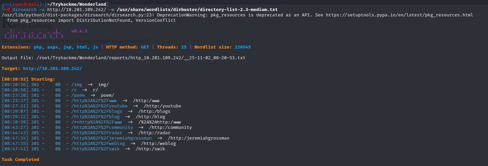

We have important two directory **/poem** and **/r**.l check first
**/poem** directory.We see just poem.

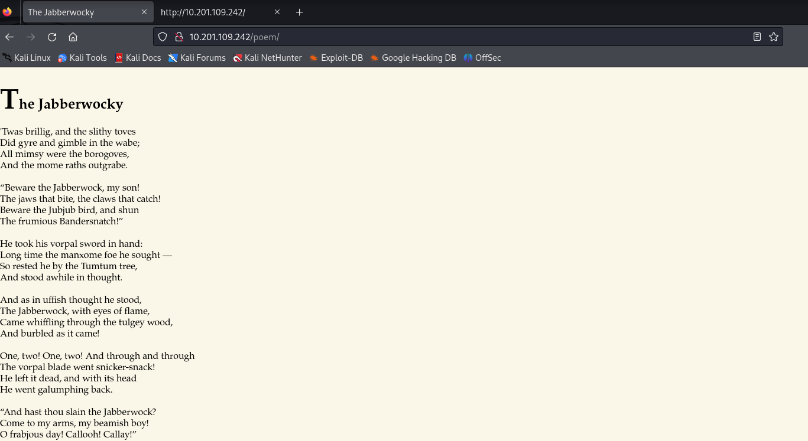

l check again source code l again we found nothing after l go to check
**/r** directory.

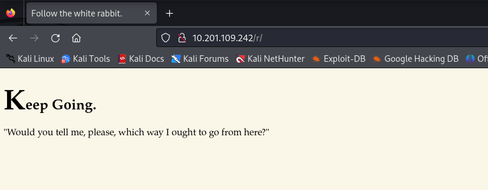

We see “*Keep Going*” and “*Would you tell me, please, which way I ought
to go from here?*”

Okay go again directory search.

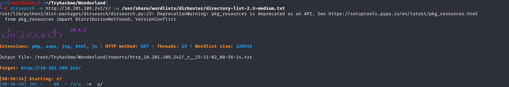

We found **/r/a** directory and **/r/a** again say keep going maybe we
must check **/r/a/b/b/i/t** directory because l remember **hint.txt**
say follow the **r a b b i t.** l check **/r/a/b/b/i/t** directory yes
we found it.

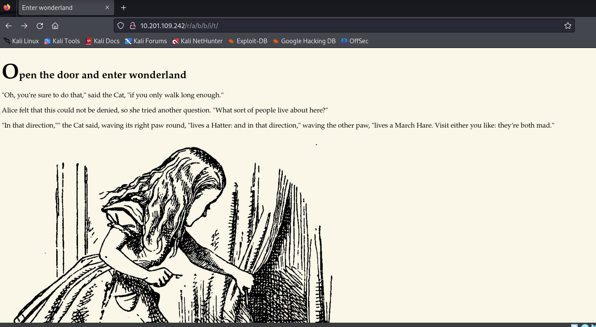

Again message and photo l check this photo **metadata** maybe again some
secret things but it wants passphrase.

After this l decided check source code and l found **user** and
**pass**.

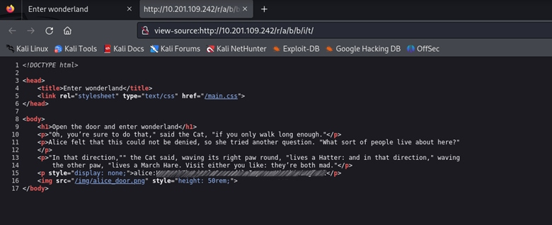

l use this **user** and **pass** for the connect **ssh**.

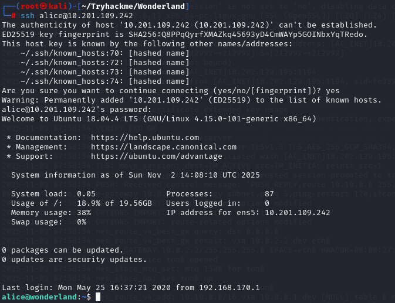

When l look file found **root.txt** but l didn’t have permission to
read.

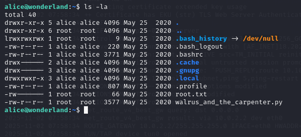

We see **walrus_and_the_carpenter.py.**l check this python file and we
see python code about **poem** and we see **random** library.

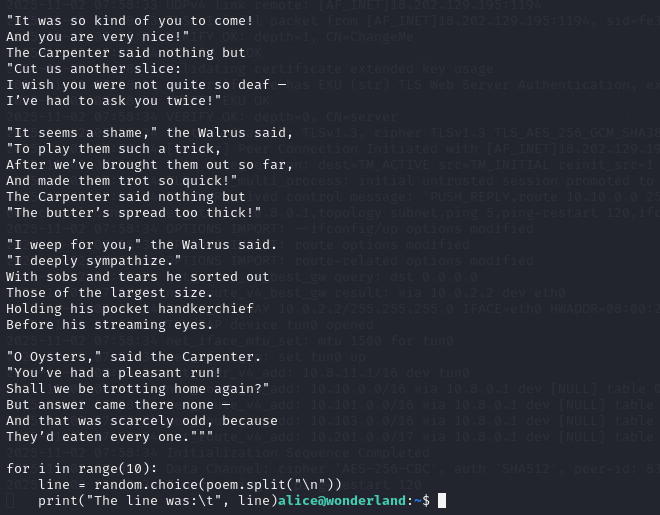

After this l use **sudo -l** command for look user privileges.

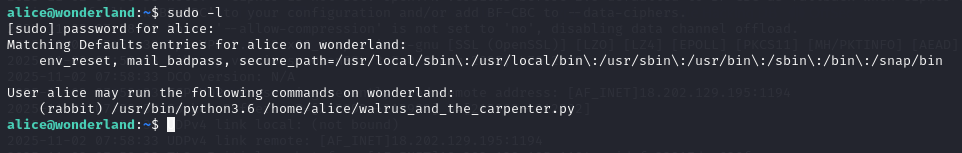

The target script runs as the user **rabbit**. Python searches the
script’s directory before the standard library when importing modules,
so a local **random.py** will shadow the builtin. I created a local
**random.py** containing **import os; os.system("/bin/bash");** when
**walrus_and_the_carpenter.py** imported random, the code executed and
spawned a Bash shell running with Rabbit’s privileges.

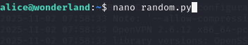

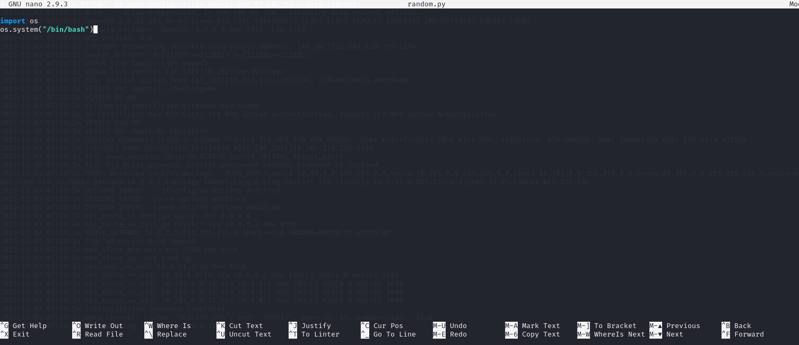

After we got rabbit shell l check **/home/rabbit** and l see
**teaParty** file.

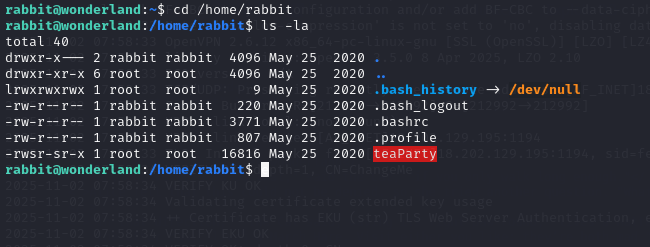

l upload this file my own linux and use strings command for read
human-readable strings in file.

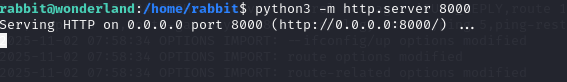

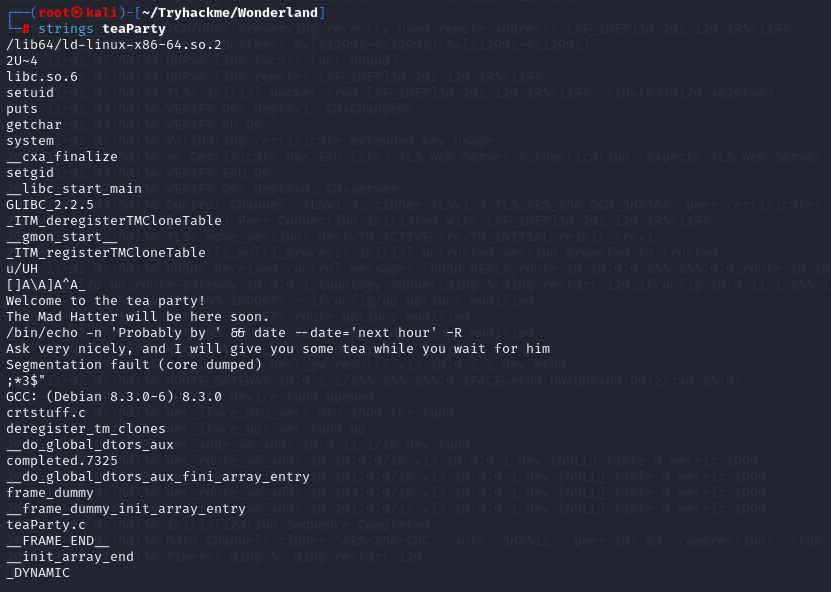

l found **/bin/echo -n ‘Probably by ‘ && date –date=’next hour’-R**.This is same thing with when we use alice user to go rabbit user.l
create date file and write **bash script**,**permission** and **export**
**path**)

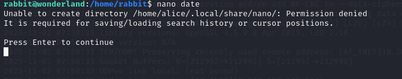

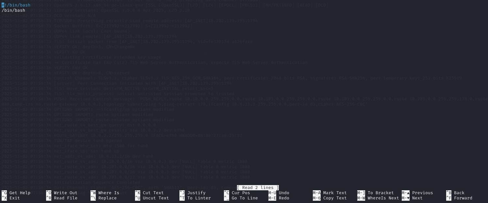

Okay when we run **teaParty** file we must get **hatter** user shell.

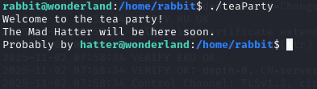

Yes we get **habbit** user shell.

I examined the **/home/hatter** directory and found a file containing
the hatter user's password. I then executed **su hatter** and entered
the discovered password to obtain a full login shell with hatter's
privileges.

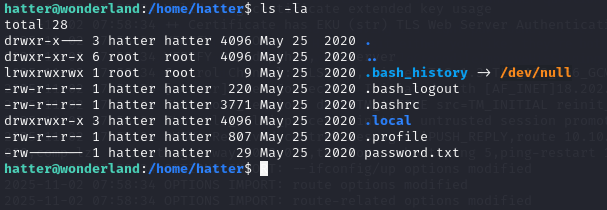

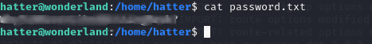

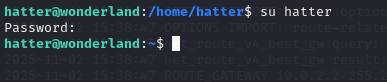

l search suid binaries with **find / -perm -4000 -type f 2\>/dev/null**
but l can’t find any useful vector.l decided check capabilities with
**getcap -r / 2\>/dev/null** and l found **perl** capabilities.

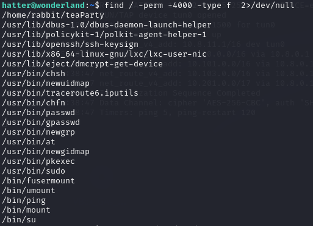

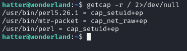

We can use this **perl** capabilities for privileges escalation.l go to
[gtfobins](https://gtfobins.github.io/) and find **perl capabilities**.We can use this for privileges
escalation.

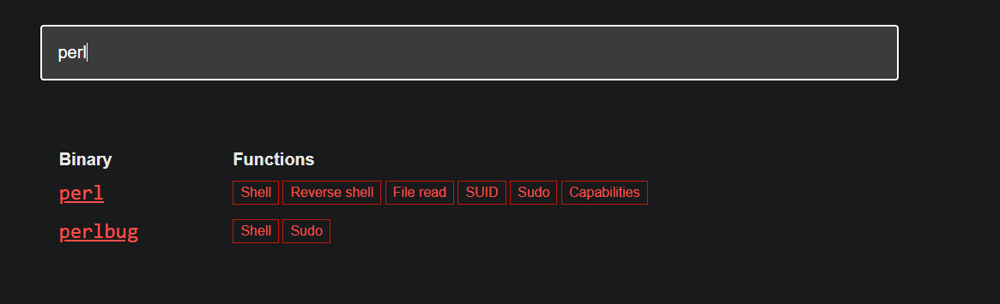

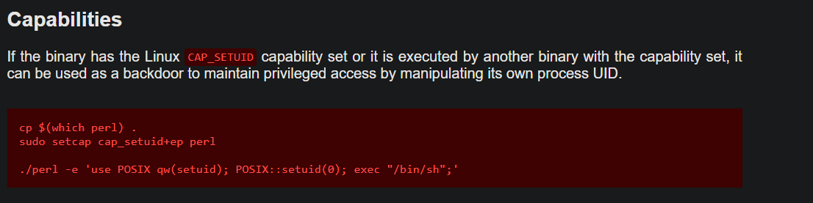

We use **/usr/bin/perl -e 'use POSIX qw(setuid); POSIX::setuid(0); exec
"/bin/sh";'** command we get **root** user and found **user** and
**root** flag.

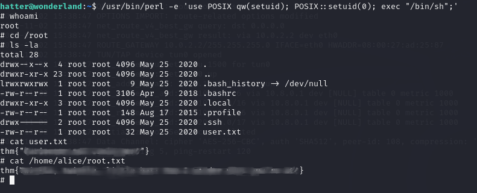
